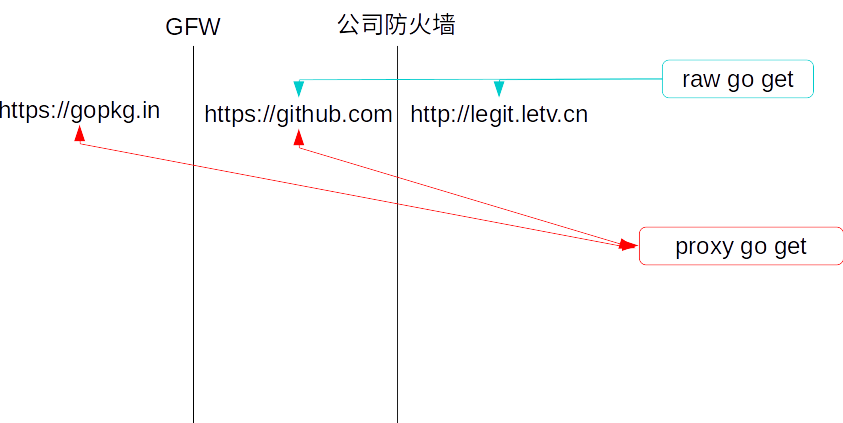

  

1. 如上图，普通的go get拿不到gopkg.in的包  
2. 如上图，用http代理 http_proxy=127.0.0.1:12345 go get 又拿不到legit.letv.cn的包  
3. 所以我需要一个聪明的http.proxy代理区别是否走代理还是直连  

解决方案：  
1. 配置一个聪明的http proxy可以判断是否用代理  
2. 配置privoxy,　连接一个sock5代理  

　　　listen-address  0.0.0.0:12345  
　　　forward-socks5  / 10.75.144.195:1081 .  
　　　forward         192.168.*.*/     .  
　　　forward            10.*.*.*/     .  
　　　forward           127.*.*.*/     .  
　　　forward           localhost/     .  
　　　forward           legitlab.letv.cn/       .  
　　　forward           git.letv.cn/ .  
  
  　　注意forward后面有.  
        
        
执行：  
http_proxy=http://127.0.0.1:12345 https_proxy=http://127.0.0.1:12345 go get --insecure -u legitlab.letv.cn/yig/yig/  
安装所有依赖  
 
说明:  
1. go get也需要用http[s]_proxy,而且只能用这种方式代理，如proxychains也出不去  
2. go会fork出一个git clone来，~/.gitconfig里面可以配置http.proxy覆盖环境变量, 而且也可以根据域名选择是否用proxy, 详细man git-config  
3. insecure是因为公司的gitlab没有https,不过也可以man git-config配置不检查ssl  
